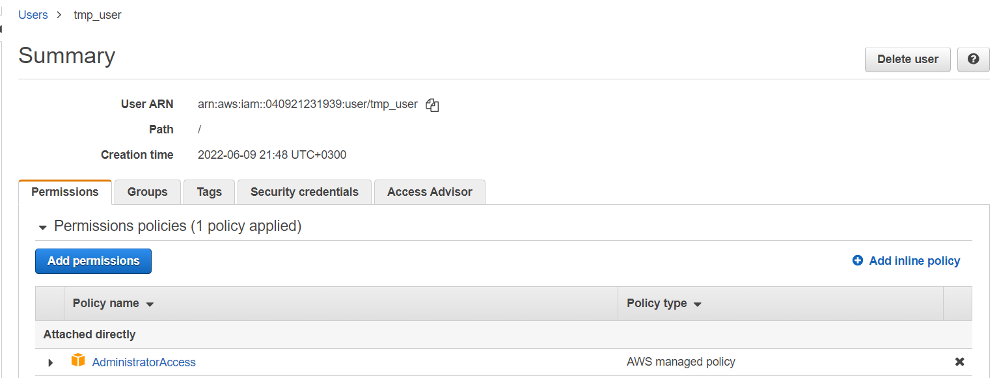
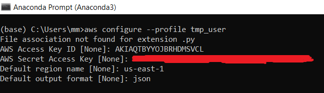
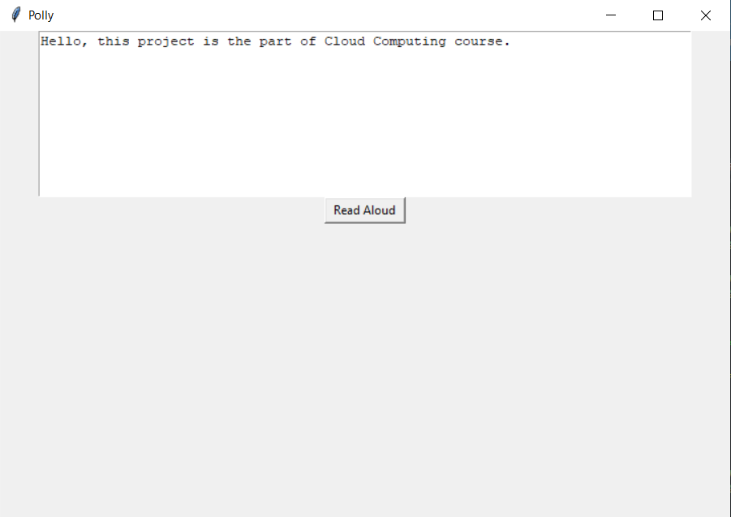

# aws_polly
## YAZ16408 Bulut Bilişim Dersi Final Ödevi

### Geliştirici
1180505612 - Mekan Myradov

### Giriş
Amazon Polly, metni konuşmaya çeviren bulut tabanlı bir sistemdir. Amazon Polly birçok dili ve gerçekçi sesleri desteklemektedir. Bu sistemi kullanırken sadece metinden sentezlenen konuşma ödeme yapılır. Sentezlenen konuşmalar ileride kullanılmak üzere kaydedilebilir ve ücretsiz olarak kullanılabilir.
Bu çalışmada Python Boto3 kütüphanesini kullanarak metni konuşmaya çeviren bir uygulama yapılmıştır.

### AWS ile ilgili İşlemler
Geliştirilen uygulamanın AWS’e erişebilmesi için tmp_user isimli Yönetici yetkilerine sahip bir kullanıcı oluşturulmuştur. Bu kullanıcıyı alttaki şekilde görebilirsiniz.

### AWS Kullanıcısını Boto3’e Bağlama
AWS'ye Python Boto3 kullanarak erişmek için Boto3'ün hangi kullanıcıdan erişeceğini belirtmek gerekir. Bu, awscli adlı Python kütüphanesi kullanılarak yapılabilir. Bu kütüphane pip install awscli komutu ile kurulabilir.
Yukarıda oluşturulan tmp_user isimli kullanıcıyı Boto3'e bağlamak için alttaki şekildeki gibi bir profil oluşturulur.

Kullanıcı Boto3'e bağlandıktan sonra yukarıdaki aws komutu ile oluşturulan profilin adı ve AWS hizmeti belirtilerek AWS'nin tüm hizmetlerine kod aracılığıyla erişilebilir.

### Uygulamanın Demosu
Uygulama çalıştırıldığından sonra çıkan sonucu altta görebilirsiniz. “Read Aloud” butonuna tıklandığında ise bilgisayarın varsayılan medya oynatıcısı yazılan metini konuşmaya çevirecektir.:

